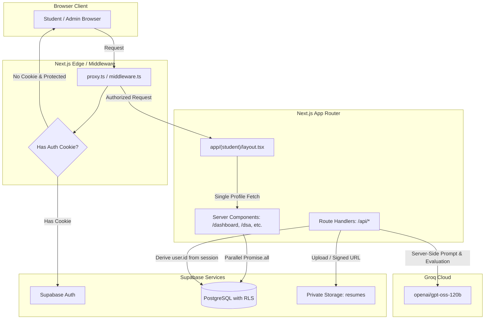

# PlacementAI

PlacementAI is an AI-powered placement preparation platform for engineering students that combines resume analysis, AI mock interviews, skill-gap analysis, DSA tracking, job application management, and personalized preparation roadmaps in one platform.

Built with Next.js 16 (App Router), React 19, TypeScript, Tailwind CSS v4, Supabase (PostgreSQL, Auth, Storage), and Groq Cloud AI, PlacementAI provides engineering students with an integrated preparation suite and gives institutional administrators visibility into candidate readiness.

---

## 🚀 Key Features

### 1. AI Resume Analyzer
- **Private PDF Storage**: Uploads master resumes directly to a private Supabase Storage bucket (`resumes`).
- **Server-Side Extraction**: Parses PDF text securely on the server using `unpdf` without external binary dependencies.
- **AI-Generated Readiness Assessment**: Evaluates resume content against technical role expectations using Groq LLM inference, providing an AI-calculated readiness score (ATS-style alignment).
- **In-Depth Diagnostic**: Extracts detected technical keywords, highlights key resume strengths, identifies critical keyword/skill gaps, and suggests actionable bullet-point rewrites.
- **Secure Access**: Historic resumes are securely stored and previewed exclusively through temporary, server-generated signed URLs.

### 2. AI Mock Interview Simulator
- **Role-Specific Scenarios**: Generates interviews tailored to target roles (e.g., Software Development Engineer, Frontend, Backend) across Technical, Behavioral, and Mixed rounds.
- **Configurable Difficulty**: Students can select difficulty levels (Easy, Medium, Hard) to match their preparation stage.
- **Structured Response Interface**: Students submit detailed responses through an interactive session interface with instant AI evaluation.
- **Adaptive Question Progression**: Dynamically calibrates subsequent questions based on real-time performance—reinforcing fundamentals if scores fall below 6.0/10 or introducing edge cases and scalability trade-offs for scores of 8.0/10 and above.
- **Comprehensive Evaluation**: Groq evaluates student answers in real time, scoring each response (0.0–10.0) and providing constructive feedback on conceptual clarity, problem-solving methodology, and STAR-format structure.
- **Persisted Drill History**: Full interview logs, individual question responses, and feedback summaries are persisted for longitudinal review.

### 3. Skill Gap Analysis
- **Target Role Benchmarking**: Evaluates a student's declared skills against industry expectations for engineering roles.
- **Deterministic Skill Matching**: Categorizes competencies into matching skills, missing required skills, and recommended complementary skills.
- **Quantified Match Score**: Calculates a deterministic percentage match to benchmark current qualifications.
- **Prioritized Recommendations**: Generates concrete, step-by-step learning recommendations to bridge identified gaps.

### 4. DSA Progress Tracker
- **Curated Problem Catalog**: 37 high-frequency interview problems across 10 core algorithmic categories (Arrays, Strings, Linked Lists, Stack & Queue, Binary Search, Trees, Graphs, Backtracking, Dynamic Programming, Sorting & Searching) inspired by standard interview sheets such as Blind 75.
- **Status & Notes Tracking**: Tracks individual problem status (`not_started`, `in_progress`, `solved`) with custom student notes and direct links to external problem platforms.
- **Automated Aggregation**: Server-side API handlers calculate and maintain aggregate counts (`easy_solved`, `medium_solved`, `hard_solved`, `total_solved`) in `dsa_progress` without requiring client-side recalculation.

### 5. Job Application Tracker
- **Recruitment Pipeline CRUD**: Complete management for campus and off-campus recruitment drives.
- **Application Lifecycle**: Tracks applications across five standardized stages: `applied`, `oa` (Online Assessment), `interview`, `offer`, and `rejected`.
- **Comprehensive Records**: Captures company name, job title, application date, CTC package, job posting URL, location, and drive-specific notes.
- **Search & Filtering**: Real-time client-side search and stage filtering for rapid application management.

### 6. Personalized Placement Roadmap
- **Holistic AI Synthesis**: Aggregates the student's complete profile—target role, declared skills, latest skill gap analysis, solved DSA topics, and resume scores.
- **Structured Multi-Week Schedule**: Groq generates an adaptive multi-week study plan with concrete, actionable tasks distributed across preparation weeks.
- **Interactive Progress Persistence**: Students can toggle individual task completion, automatically updating weekly progress bars and overall roadmap completion percentages.

### 7. Student Dashboard
- **Calculated Readiness Index**: Dynamic placement readiness score derived from verified data points: DSA mastery (40%), Resume ATS-style score (30%), and Mock Interview performance (30%).
- **AI Coach Recommendations**: Actionable guidance highlighting the most impactful next preparation step based on active database records.
- **Live Metrics Hub**: Quick-access cards summarizing resume status, coding mastery, interview rounds, and verified skills.

### 8. Admin Console
- **Institutional Oversight**: Dedicated console for campus placement officers and administrators.
- **Domain-Isolated Student Directory**: Roster of registered candidates filtered strictly to authorized institutional emails (`@mite.ac.in`).
- **Platform Analytics**: Aggregate oversight of total enrolled candidates, resumes scanned, mock rounds conducted, and active DSA trackers.

---

## 🏗️ Architecture

PlacementAI is engineered on the **Next.js App Router** with React Server Components (RSC), delivering fast server rendering, secure data access, and minimal client-side JavaScript.



### Performance Optimizations
1. **Shared Route-Group Layout (`app/(student)/layout.tsx`)**:
   - Centralizes authentication, institutional domain validation, and the `DashboardHeader` profile lookup.
   - Preserves layout state across client transitions between `/dashboard`, `/dsa`, `/roadmap`, `/job-applications`, `/skill-gap`, `/mock-interview`, and `/resume-analyzer`.
   - Eliminates redundant header re-renders and repeated profile database queries.

2. **Elimination of Client-Side Data Waterfalls**:
   - Initial read operations for `/dsa`, `/roadmap`, and `/job-applications` are preloaded concurrently on the server using `Promise.all`.
   - Data is passed directly to client components as initial props, eliminating initial loading spinners and redundant `GET` requests on mount while preserving API routes for mutations.

3. **Middleware Fast-Path**:
   - Inspects incoming cookie headers; requests without Supabase auth cookies targeting protected routes redirect immediately without making an external network round-trip.
   - Static assets and media files are excluded from middleware processing via optimized regex matchers.

4. **AuthProvider Transition Optimization**:
   - Eliminated unnecessary `router.refresh()` executions on `INITIAL_SESSION` and token refresh events, avoiding duplicate server-side page renders during client navigation.

---

## 🔒 Authentication & Security Architecture

- **Supabase Auth (`@supabase/ssr`)**: Cookie-based session management across middleware, Server Components, Route Handlers, and Client Components.
- **Institutional Domain Restriction**:
  - Student registration and login enforce `@mite.ac.in` email addresses at the client, server action, and database trigger levels.
  - Non-institutional accounts are prevented from accessing student portal routes.
- **Role-Based Routing Isolation**:
  - Dedicated authorized administrator account is strictly isolated.
  - Admin users attempting to access student routes are redirected to `/admin`.
  - Non-admin users attempting to access `/admin` are redirected to `/admin/login`.
- **Row-Level Security (RLS)**:
  - RLS is enabled on all 10 PostgreSQL tables and the `resumes` storage bucket.
  - Student policies enforce strict ownership: `auth.uid() = user_id`.
  - Institutional read policies allow authorized admin access strictly for candidate evaluation.
- **No Service-Role Key**:
  - The application operates with zero usage of `SUPABASE_SERVICE_ROLE_KEY`. All database operations execute strictly within the authenticated user's session context.
- **Server-Derived Identity**:
  - Route Handlers and Server Actions derive `user.id` exclusively from `supabase.auth.getUser()`, never trusting client-supplied parameters.
- **Private Object Storage**:
  - Resume files are stored in a private Supabase Storage bucket. Direct public URL access is denied; access requires temporary, server-generated signed URLs.

---

## 🤖 AI Architecture

- **Inference Engine**: Groq Cloud API using the OpenAI-compatible SDK (`openai`).
- **Model**: `openai/gpt-oss-120b` (high-throughput, low-latency LLM inference).
- **Server-Side Execution**: All AI prompts, completions, and evaluations occur strictly server-side (`lib/ai/`, `lib/resume/`, `lib/interview/`, `lib/skill-gap/`, `lib/roadmap/`). The `GROQ_API_KEY` is never exposed to the client.
- **Structured JSON Output**: Prompts enforce structured JSON responses with schema validation and fallback handling to guarantee consistent application state.

---

## 🗄️ Database Schema

The database is built on PostgreSQL hosted on Supabase and managed through 9 versioned migrations (`supabase/migrations/`):

| Table | Description | Key Columns / Relations |
| :--- | :--- | :--- |
| `profiles` | Student and user account profiles | `id` (PK, references `auth.users`), `full_name`, `email`, `target_role`, `college`, `graduation_year`, `bio` |
| `skills` | Student-declared technical skills | `id` (PK), `user_id` (FK), `skill_name`, `skill_level` |
| `resumes` | Uploaded resumes and ATS diagnostic metadata | `id` (PK), `user_id` (FK), `file_name`, `storage_path`, `ats_score`, `analysis` (JSONB) |
| `mock_interviews` | Recorded mock interview sessions | `id` (PK), `user_id` (FK), `interview_type`, `target_role`, `difficulty`, `status`, `questions` (JSONB), `score`, `feedback` (TEXT) |
| `skill_gap_analyses` | Skill evaluations against target roles | `id` (PK), `user_id` (FK), `target_role`, `current_skills` (JSONB), `required_skills` (JSONB), `missing_skills` (JSONB), `recommendations` (JSONB), `skill_match_percentage` |
| `dsa_problems` | Master catalog of curated DSA problems | `id` (PK), `title`, `slug`, `topic`, `difficulty`, `platform`, `external_url`, `created_at` |
| `user_dsa_progress` | Individual problem solve status | `id` (PK), `user_id` (FK), `problem_id` (FK), `status` (`not_started`/`in_progress`/`solved`), `solved_at`, `notes` |
| `dsa_progress` | Aggregate student DSA metrics | `id` (PK), `user_id` (FK), `easy_solved`, `medium_solved`, `hard_solved`, `total_solved` (Server-synced) |
| `job_applications` | Job application tracker records | `id` (PK), `user_id` (FK), `company_name`, `job_title`, `application_date`, `status`, `job_url`, `location`, `package_ctc`, `notes` |
| `placement_roadmaps` | AI-generated multi-week preparation plans | `id` (PK), `user_id` (FK), `target_role`, `title`, `duration_weeks`, `roadmap_data` (JSONB), `overall_progress`, `status` |

---

## 💻 Tech Stack

| Category | Technology |
| :--- | :--- |
| **Framework** | Next.js 16.3.5 (App Router, Turbopack, React Server Components) |
| **Frontend Library** | React 19.2.8 / React DOM 19.2.8 |
| **Language** | TypeScript 5 |
| **Styling** | Tailwind CSS v4 (`@tailwindcss/postcss`) |
| **Icons** | Lucide React |
| **Database & Auth** | Supabase (PostgreSQL, Supabase Auth, Supabase Storage) |
| **Supabase SDKs** | `@supabase/ssr` 0.12.7, `@supabase/supabase-js` 2.116.0 |
| **AI Inference** | Groq Cloud (`openai` SDK 7.20.0, Model: `openai/gpt-oss-120b`) |
| **PDF Extraction** | `unpdf` 1.8.1 |
| **Deployment** | Vercel (Frontend & Serverless Handlers), Supabase (Data Layer), Groq (AI Layer) |

---

## 🛠️ Local Development Setup

### Prerequisites
- **Node.js**: `v18.18.0` or higher (Node.js 20+ recommended)
- **Package Manager**: `npm`, `yarn`, `pnpm`, or `bun`
- **Supabase Account**: A Supabase project with database, auth, and storage enabled
- **Groq Cloud Account**: An API key from [Groq Cloud](https://console.groq.com)

### 1. Clone the Repository
```bash
git clone https://github.com/pavanmradder/placement-ai.git
cd placement-ai
```

### 2. Install Dependencies
```bash
npm install
```

### 3. Configure Environment Variables
Create a `.env.local` file in the project root based on `.env.example`:

```bash
cp .env.example .env.local
```

Fill in the required values in `.env.local`:
```env
# Supabase Configuration (Client and Server)
NEXT_PUBLIC_SUPABASE_URL="https://your-project-id.supabase.co"
NEXT_PUBLIC_SUPABASE_PUBLISHABLE_KEY="your-supabase-publishable-or-anon-key"

# Groq Configuration (Server-Side Only - Never prefix with NEXT_PUBLIC_)
GROQ_API_KEY="your_groq_api_key_here"
GROQ_MODEL="openai/gpt-oss-120b"
```

### 4. Database Setup
Apply the database migrations in sequential order using the Supabase CLI or by running the SQL scripts in `supabase/migrations/` in your Supabase SQL Editor:

1. `20260917000000_initial_schema.sql` (Profiles, skills, initial tables)
2. `20260917010000_enforce_email_domains.sql` (Domain restriction triggers)
3. `20260917020000_admin_read_access.sql` (Admin read policies)
4. `20260920000000_resume_storage.sql` (Resumes table & private `resumes` storage bucket with 5 MB limit and `application/pdf` constraint)
5. `20260920010000_mock_interviews_schema.sql` (Mock interview tables & RLS)
6. `20260920020000_skill_gap_schema.sql` (Skill gap analysis schema)
7. `20260920030000_dsa_tracker_schema.sql` (DSA catalog & user progress schema)
8. `20260921000000_job_applications_schema.sql` (Job application tracker schema)
9. `20260921010000_placement_roadmap_schema.sql` (Placement roadmap schema)

Ensure a private storage bucket named `resumes` is created in your Supabase Storage dashboard (or provisioned via migration `20260920000000_resume_storage.sql`).

### 5. Run the Development Server
```bash
npm run dev
```

Open [http://localhost:3000](http://localhost:3000) in your browser.

### 6. Verification Commands
```bash
# Type checking
npx tsc --noEmit

# Production build verification
npm run build
```

---

## 🚀 Deployment

PlacementAI is optimized for deployment on **Vercel**:

1. **Connect Repository**: Import the repository into your Vercel dashboard.
2. **Configure Environment Variables**: Add `NEXT_PUBLIC_SUPABASE_URL`, `NEXT_PUBLIC_SUPABASE_PUBLISHABLE_KEY`, `GROQ_API_KEY`, and `GROQ_MODEL` in your Vercel project settings.
3. **Build & Deploy**: Next.js App Router and Server Components will be built and deployed automatically.

---

## 📄 License

This project is open source and available under the MIT License.
